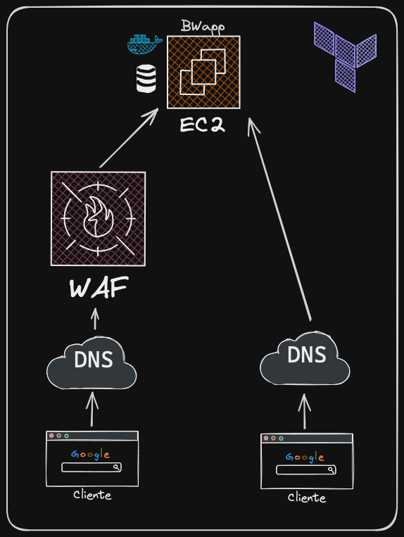

# Instancia EC2 con Docker y BWAPP usando Terraform

El proyecto consiste en el despliegue mediante infraestructura como código (IaC) de una Arquitectura Cloud, donde se expone la aplicación con vulnerabilidades llamada buggy web application (bWAPP) en la Cloud de AWS. 

Luego  se la seguriza mediante un servicio WAF en nube de Cloudflare, con el objetivo de prevenir un ataque seleccionado de las tácticas y técnicas representadas en la base de conocimientos de MITRE ATT&CK®.

A continuación, se detallan las etapas ejecutadas y en proceso de desarrollo.

> Pueden consultar y descargar el codigo fuente de [Github - Codigo fuente](https://github.com/facundotorraca/msi-2024-g6/tree/master/M41.2.03)


Esta guía proporciona instrucciones paso a paso sobre cómo usar Terraform 
para crear una instancia EC2 en AWS, instalar Docker y ejecutar la aplicación BWAPP.

La instancia se creará con un par de claves especificado para el acceso seguro por SSH.

> :warning: **imporante**: Este setup tiene un costo sobre la cuenta de Amazon, que si bien es minimo, no es totalemnte gratis. Esto se debe a que Amazon pasó a cobrar por las IPs publicas de sus servicios gratuitos (0.005 USD por hora). Recuerda ejecutrar el paso #6 para realizar la limpieza y evitar sorpresas!


## Requisitos previos

1. **Cuenta de AWS**: Debes tener una cuenta de [AWS](https://aws.amazon.com/).
2. **Cuenta en Cloudflare**: Debes tener una cuenta en [Cloudflare](www.cloudflare.com)
3. **Un dominio**: Puedes comprar un _.xyz_ por $1 USD en [Namecheap](www.namecheap.com)
3. **AWS CLI**: Instalar y configurar AWS CLI con los permisos necesarios.
4. **Terraform**: Instalar Terraform en tu máquina local.

## Arquitectura



## Setup

### 1. Configurar AWS CLI

Primero, configura AWS CLI con tus credenciales. 
Esto creará un perfil que Terraform puede usar.

```sh
aws configure --profile <mi-perfil-terraform>
```

Se te pedirá que ingreses tu AWS Access Key ID, AWS Secret Access Key, 
nombre de la región por defecto y formato de salida por defecto.


### 2. Establecer la Variable de Entorno

Establece la variable de entorno AWS_PROFILE para usar el perfil que configuraste.

```sh
export AWS_PROFILE=<mi-perfil-terraform>
```

### 3. Linkear dominio a Cloudflare

Puedes seguir esta [guia](https://developers.cloudflare.com/fundamentals/setup/manage-domains/add-site/) para linkear tu dominio a _Cloudflare_.

Si segusite las recomendaciones de esta guia y adquiriste el dominio por _Namecheap_, puedes seguir esta [guia](https://www.namecheap.com/support/knowledgebase/article.aspx/9607/2210/how-to-set-up-dns-records-for-your-domain-in-a-cloudflare-account) de como vincular los servidores DNS

### 4. Crear infraestructura

#### 4.1 Inicializar Terraform

Inicializa la configuración de Terraform. Esto descargará los plugins necesarios del proveedor

```sh
terraform init
```

#### 4.2 Plan de la configuracion

Genera y revisa el plan de ejecución para la infraestructura. Esto te mostrará lo que Terraform va a crear o cambiar.

```sh
terraform plan
```

#### 4.3 Aplicar la configuracion

Aplica la configuración de Terraform para crear los recursos.

```sh
terraform apply
```

#### 4.4 Output

Luego de la ejecución, terraform dará los siguientes resultados:

```sh
* cloudflare_record = "<Nombre del dominio>"
* ec2_public_ip     = "<IP Publica del servicio>"
* ec2_public_dns    = "<DNS Publico para acceder>"
* ec2_instance_id   = "<ID de la instancia en EC2>"
```

**_NOTE:_**  En la proxima sección explicaremos en detalle como usar el public DNS para acceder a la aplicación BWapp.

Podras consultarlo tambien con:

```sh
terraform output <variable>
```

### 5. Inicializar la aplicación BWapp

Una vez instalado todo, podrás acceder a tu servicio por HTTPs como:

`www.<dominio>.com`

Primero debes instalar la base de datos, para eso:
1. Ingresa a `www.<dominio>.com/install.php`
2. Hace click en instalar 

Una vez instalado, puedes ir a la pagina y loaggearte con las credenciales defualt:

* **username**: _bee_
* **password**: _bug_

Ya puedes disfrutar de todas las vulnerabilidades :smile:

### 6. Limpieza

> :warning: **imporante**: Ejecuta este paso, ya que las IPs publicas de amazon tienen un costo. Si no se ejecuta este paso, 

Para destruir la infraestructura creada por Terraform, ejecuta:

```sh
terraform destroy
```

Confirma la acción cuando se te solicite escribiendo "yes".

## Ejemplos

A continuación mostraremos alguno ejemplos de como poder probar la aplicación.
Como resultado de correr el setup, deberiamos tener 2 links:

* `http://<ec2_public_dns>.com` -> DNS publico de la instacia de EC2. Este link nos conecta a la aplicación _bWAPP_ sin pasar por _Cloudflare_

* `https://<cloudflare_record>.com` -> Dirección que pasa por el DNS de _Cloudflare_.

Si bien ambos links llevan a la misma aplicación (e instancia EC2), el primero no tiene la protección de nuestro WAF.

Recomendamos probar cada uno de los ejemplos en ambos links, para poder visualizar correctamente el funcionamiento del WAF

### 1. SQL Injection

```sql
iron man' union select 1,user(),database(),load_file('/etc/passwd'),version(),6,7 -- - %'
```

Este SQL injection manipula una consulta añadiendo una sentencia **UNION** para combinar los resultados con otra consulta que recupera información sensible del sistema, como el usuario actual (_`user()`_), la base de datos actual (_`database()`_), el contenido del archivo del sistema (_`load_file('/etc/passwd')`_), y la versión del servidor (_`version()`_).

La secuencia comienza con una entrada de texto maliciosa 'iron' que cierra una cadena de texto abierta en la consulta original, seguido de la inyección **UNION SELECT** y las funciones mencionadas, finalizando con un comentario **-- - %'** para ignorar el resto de la consulta original.

[SQL Injection Mitre attack](https://attack.mitre.org/techniques/T1190/)

### 2. XSS Injection

```html
<!-- Linea 1 --> <script>alert(document.cookie)
</script> <!-- Linea 2 -->                       
```
Este XSS injection se basa en insertar código JavaScript malicioso a través de entradas de usuario. El _input-1_ `<script>alert(document.cookie)` introduce una etiqueta `<script>` que ejecuta el comando alert(document.cookie), mostrando las cookies del usuario en una ventana de alerta.

El _input-2_ cierra la etiqueta `<script>` abierta, asegurando que cualquier otro contenido después del script no se interprete como parte de él, lo que puede evadir restricciones de seguridad y hacer que el navegador ejecute el script malicioso

[XSS Injection Mitre attack](https://attack.mitre.org/techniques/T1189/)